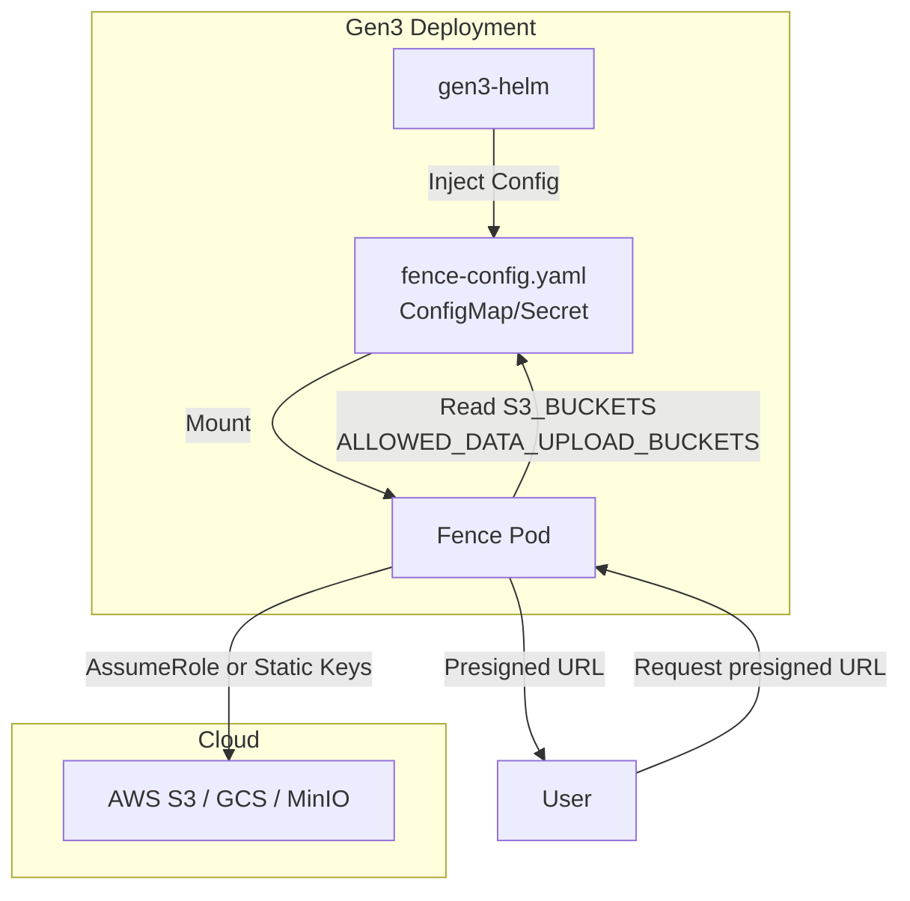
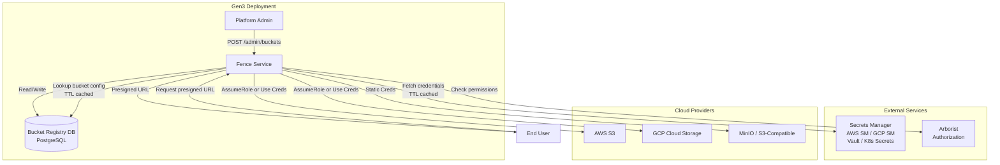
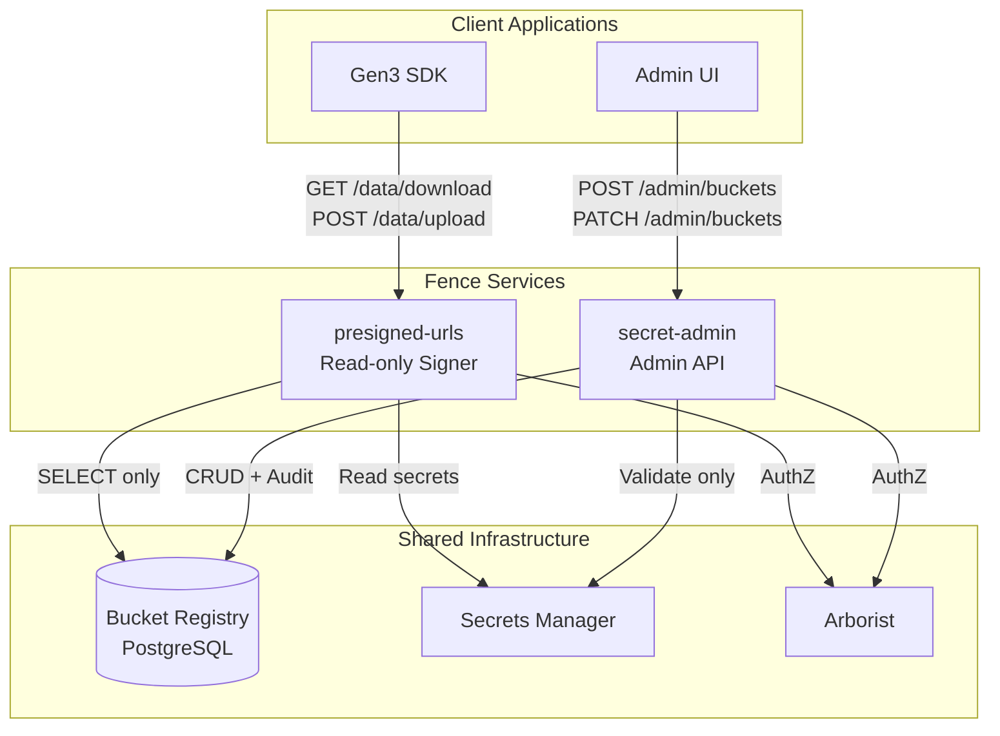

# Dynamic Bucket Management

## Gen3 Community Feature Document

## Author(s) 

| Author Name | Email Address | Organization or Team |
| :---- | :---- | :---- |
| UChicago Development Team | support@gen3.org | University of Chicago CTDS |

##  Reviewer(s) 

| Reviewer Name | Email Address | Review Date |
| :---- | :---- | :---- |
|  |  |  |

##  Major Version History (Optional)

| Version Name or Number | Date | Comments/Major changes |
| :---- | :---- | :---- |
| 1.0.0 | 2024 | Initial feature specification based on feature/dynamic-buckets branch |

# Requirements

This section describes the user needs and requirements for enabling dynamic bucket management in Fence, allowing runtime configuration of storage buckets without requiring infrastructure redeployment.

## Purpose

The Dynamic Bucket Management feature enables Gen3 administrators and project owners to manage cloud storage buckets (AWS S3, GCP Storage, MinIO, S3-compatible) dynamically through an administrative API, without requiring Helm redeployment or pod restarts. This addresses the current limitation where bucket configurations are static and hardcoded in `fence-config.yaml`, requiring DevOps intervention for every change.

**In Scope:**
- Database-backed bucket registry to replace static YAML configuration
- Administrative REST API for CRUD operations on bucket configurations
- Support for multiple cloud providers (AWS, GCP, MinIO, S3-compatible)
- Integration with external secrets managers (AWS Secrets Manager, GCP Secret Manager, HashiCorp Vault, Kubernetes Secrets)
- Role-based authentication (AWS STS AssumeRole, GCP Workload Identity) as preferred method
- Static credential support for legacy/S3-compatible endpoints
- Fine-grained authorization using Arborist resource bindings
- Optional prefix-level bucket access control
- Credential rotation without downtime
- Migration path from existing YAML-based configuration
- Audit logging for all bucket administrative operations

**Out of Scope:**
- Changes to existing presigned URL generation logic (maintains compatibility)
- User-facing UI for bucket management (admin API only)
- Direct bucket creation in cloud providers (assumes buckets exist)
- Modification of Indexd or other Gen3 services
- Automatic bucket provisioning or infrastructure-as-code integration

## Use Cases

| # | Context | Priority (A/B/C) | Use Case(s) |
| :---- | :---- | :---- | :---- |
| 1 | Platform administration | A | As a Gen3 platform administrator, I want to register a new AWS S3 bucket with role-based authentication so that users can access it for data upload/download without requiring a Helm redeploy. |
| 2 | Multi-tenant environments | A | As a project owner, I want to configure bucket access with specific prefix restrictions (e.g., `/project-A/data/`) so that my project users can only access their designated storage areas. |
| 3 | Security and compliance | A | As a security administrator, I want to rotate bucket credentials stored in AWS Secrets Manager so that access keys are regularly updated without service downtime. |
| 4 | MinIO/on-premises storage | A | As a platform administrator, I want to register S3-compatible endpoints (MinIO, on-prem object storage) with custom endpoints and static credentials so that we can support hybrid cloud deployments. |
| 5 | Operational flexibility | B | As a DevOps engineer, I want to suspend access to a specific bucket temporarily so that I can perform maintenance or respond to security incidents without affecting other buckets. |
| 6 | Authorization management | A | As a platform administrator, I want to bind buckets or bucket prefixes to Arborist resource paths so that I can enforce fine-grained access control aligned with our existing authorization model. |
| 7 | Migration and compatibility | A | As a platform administrator, I want to migrate existing bucket configurations from `fence-config.yaml` to the database registry so that we can transition to dynamic management without disruption. |
| 8 | GCP integration | B | As a platform administrator, I want to register GCP Storage buckets using Workload Identity so that we can leverage GCP's recommended authentication mechanism. |
| 9 | Audit and compliance | B | As a compliance officer, I want to review audit logs of all bucket configuration changes so that I can track who made what changes and when. |
| 10 | Validation and testing | B | As a platform administrator, I want to validate a new bucket configuration with a dry-run test so that I can verify connectivity and permissions before making it available to users. |

## User Flow 

### Administrative User Flow

1. **Bucket Registration (AWS with Role-based Auth)**
   - Administrator authenticates to Fence with admin privileges
   - Sends POST request to `/admin/buckets` with bucket details (name, provider=aws, region, role ARN)
   - Fence validates administrator's permissions via Arborist (requires `bucket_admin` permission)
   - Fence validates the provided role ARN and attempts a test AssumeRole operation
   - Fence creates bucket entry in database with status='active'
   - Fence logs the creation to audit table
   - Returns success response with bucket ID

2. **Bucket Registration (MinIO with Static Credentials)**
   - Administrator creates secret in AWS Secrets Manager with MinIO credentials
   - Administrator sends POST request to `/admin/buckets` with bucket details (name, provider=minio, endpoint, secret_ref)
   - Fence validates permissions and secret reference
   - Fence performs dry-run validation by fetching secret and testing connection
   - Fence creates bucket entry in database
   - Returns success response

3. **Binding Bucket to Arborist Resources**
   - Administrator sends POST to `/admin/buckets/{name}/bindings`
   - Specifies resource path (e.g., `/data/program/DEV/project/ABC`) and allowed operations (read, write, delete, multipart)
   - Fence creates policy binding in database
   - Future presign requests will check this binding during authorization

4. **Credential Rotation**
   - Administrator updates credentials in external secrets manager (AWS Secrets Manager)
   - No action required in Fence; cached credentials expire based on TTL (5-10 minutes)
   - Next request fetches updated credentials automatically

5. **Suspending a Bucket**
   - Administrator sends DELETE request to `/admin/buckets/{name}`
   - Fence updates bucket status to 'suspended'
   - Subsequent presign/upload requests for this bucket return 403 Forbidden

### End-User Data Access Flow (Unchanged)

1. User requests presigned URL via SDK or gen3-client
2. Fence authenticates user (JWT validation)
3. Fence checks authorization via Arborist against resource path bound to bucket
4. Fence looks up bucket from database registry (with caching)
5. For role-based auth: Fence performs STS AssumeRole
6. For static creds: Fence fetches from secrets manager (with caching)
7. Fence generates presigned URL
8. Returns URL to user

## High-Level User Flow Diagram (Optional; if applicable)

```
┌─────────────────┐
│  Administrator  │
└────────┬────────┘
         │
         │ 1. POST /admin/buckets
         │    {name, provider, auth_mode, ...}
         ▼
┌─────────────────────────────┐
│  Fence Admin API            │
│  - Validate permissions     │
│  - Validate bucket config   │
│  - Test connectivity        │
└────────┬────────────────────┘
         │
         │ 2. Insert bucket record
         ▼
┌─────────────────────────────┐
│  Bucket Registry (DB)       │
│  - bucket table             │
│  - bucket_policy_binding    │
│  - bucket_audit             │
└────────┬────────────────────┘
         │
         │ 3. Data access request
         ▼
┌─────────────────────────────┐
│  Fence Data API             │
│  - AuthN/AuthZ              │
│  - Lookup bucket from DB    │
│  - Fetch credentials        │
│  - Generate presigned URL   │
└────────┬────────────────────┘
         │
         │ 4. Get credentials
         ▼
┌─────────────────────────────┐
│  External Secrets Manager   │
│  - AWS Secrets Manager      │
│  - GCP Secret Manager       │
│  - HashiCorp Vault          │
│  - Kubernetes Secrets       │
└─────────────────────────────┘
```

## Functional Requirements

1. **Bucket Registry Management**
   - System must store bucket metadata in a PostgreSQL database
   - System must support CRUD operations on bucket configurations
   - System must maintain audit log of all configuration changes
   - System must support bucket status (active, suspended)

2. **Multi-Provider Support**
   - System must support AWS S3 buckets with region configuration
   - System must support GCP Cloud Storage buckets
   - System must support MinIO with custom endpoint URLs
   - System must support generic S3-compatible endpoints

3. **Authentication Modes**
   - System must support AWS IAM role-based authentication via STS AssumeRole
   - System must support GCP Workload Identity
   - System must support static credential authentication via external secrets manager
   - System must never store plaintext credentials in database

4. **Authorization Integration**
   - System must integrate with Arborist for permission checks on admin operations
   - System must support binding buckets to Arborist resource paths
   - System must support binding bucket prefixes to Arborist resource paths
   - System must support configurable allowed operations per binding (read, write, delete, multipart)
   - When user requests presigned URL, system must verify user has appropriate Arborist permission for the bound resource

5. **Secrets Management**
   - System must integrate with AWS Secrets Manager for credential storage
   - System must integrate with GCP Secret Manager for credential storage
   - System must support HashiCorp Vault integration
   - System must support Kubernetes Secrets as fallback
   - System must cache fetched credentials with configurable TTL (default 5-10 minutes)
   - System must support credential rotation without service restart

6. **Administrative Operations**
   - System must provide REST API for listing buckets with filtering (by status, owner_project)
   - System must provide REST API for creating new bucket configurations
   - System must provide REST API for updating bucket configurations (partial updates)
   - System must provide REST API for suspending/resuming buckets
   - System must provide REST API for validating bucket configurations (dry-run)
   - System must provide REST API for managing bucket prefix restrictions
   - System must provide REST API for managing bucket policy bindings
   - All admin operations must require appropriate Arborist permissions

7. **Migration and Backward Compatibility**
   - System must provide CLI command to migrate buckets from `fence-config.yaml` to database
   - System must support fallback to YAML configuration when database is empty
   - System must maintain compatibility with existing presigned URL generation code
   - System must maintain compatibility with `S3_BUCKETS` and `ALLOWED_DATA_UPLOAD_BUCKETS` semantics

8. **Validation and Health Checks**
   - For AWS role-based: system must validate role ARN exists and test AssumeRole operation
   - For static credentials: system must validate secret reference exists and test connection
   - System must support dry-run validation endpoint for testing new configurations
   - System must detect and report configuration drift (optional monitoring feature)

9. **Caching and Performance**
   - System must cache bucket registry entries with configurable TTL
   - System must cache secrets/credentials with shorter TTL
   - System must support cache invalidation via admin API or TTL expiry
   - System must not require pod restart for configuration changes

## Technical Requirements

1. **Database Schema**
   - Use PostgreSQL for bucket registry
   - Implement `bucket`, `bucket_prefix`, `bucket_policy_binding`, and `bucket_audit` tables
   - Use UUID for primary keys
   - Implement proper foreign key constraints and cascading deletes
   - Implement updated_at trigger for automatic timestamp management
   - Index on frequently queried fields (name, status, owner_project)

2. **API Design**
   - RESTful API design following existing Fence conventions
   - JSON request/response format
   - Proper HTTP status codes (200, 201, 400, 403, 404, 409, 500)
   - Support for query parameters in list endpoints
   - Support for partial updates via PATCH

3. **Security**
   - All admin endpoints must require authentication (JWT)
   - All admin endpoints must require Arborist permission check
   - Secrets must never appear in API responses
   - Secrets must never be logged
   - Database must store only secret references, not plaintext credentials
   - Use IRSA (IAM Role for Service Accounts) for AWS Secrets Manager access
   - Use Workload Identity for GCP Secret Manager access

4. **Performance and Scalability**
   - Presigned URL generation should maintain current performance (target p99 < 200ms)
   - Admin operations can have higher latency (target p99 < 500ms)
   - In-memory caching to reduce database and secrets manager queries
   - Support horizontal scaling of Fence instances
   - Stateless design for signer component

5. **Observability**
   - Log all admin operations with actor, action, and result
   - Emit metrics for cache hit rates
   - Emit metrics for secrets manager latency
   - Emit metrics for STS operation latency
   - Emit metrics for presign operation latency and success rate
   - Support distributed tracing across components

6. **Configuration**
   - Environment variable for secrets backend selection (AWS_SM, GCP_SM, Vault, K8S)
   - Configurable cache TTLs
   - Configurable database connection settings
   - Support for read-only database connections (future separation of services)

7. **Error Handling**
   - Graceful degradation when secrets manager is unavailable (use cached values if within TTL)
   - Clear error messages for validation failures
   - Proper error propagation from cloud provider APIs
   - Retry logic for transient failures with exponential backoff

8. **Testing Requirements**
   - Unit tests for all new components (registry accessor, secret resolver, etc.)
   - Integration tests with LocalStack for AWS operations
   - Integration tests with MinIO for S3-compatible operations
   - Contract tests to ensure compatibility with existing Fence behavior
   - Security tests to verify secrets are never exposed
   - Load tests for presigned URL generation under high throughput

# Design and Testing

This section defines the technical solution, architecture, and testing approach for the Dynamic Bucket Management feature.

## Additional Background (Optional) 

The current implementation in Fence uses static configuration from `fence-config.yaml` (injected via Helm) to define available buckets. Two main configuration keys control bucket behavior:

- `S3_BUCKETS`: Defines known buckets for signed URL generation and object operations
- `ALLOWED_DATA_UPLOAD_BUCKETS`: Allow-list for user upload destinations

This approach has several limitations:
- Adding or modifying buckets requires Helm redeployment and pod restart
- No ability for self-service bucket management
- Credentials often stored in Helm values or ConfigMaps (security concern)
- No support for credential rotation without downtime
- Difficult to manage in multi-tenant environments

The feature/dynamic-buckets branch implements a solution that moves bucket configuration from static YAML to a database-backed registry, with external secrets management and a comprehensive admin API.

## Design Summary

The Dynamic Bucket Management feature introduces a database-backed bucket registry that replaces static YAML configuration, enabling runtime bucket management without redeployment. The design separates bucket metadata (stored in database) from credentials (stored in external secrets manager), implements a pluggable secrets resolution interface supporting multiple providers, and provides a comprehensive admin API for bucket lifecycle management. Existing presigned URL generation code is updated to read from the database registry instead of YAML configuration, maintaining full backward compatibility. The system supports both role-based authentication (AWS STS, GCP Workload Identity) and static credentials with automatic caching and rotation. An optional architecture allows splitting the presigned URL signer from admin operations into separate microservices for enhanced security and scalability.

## Release Milestones / Scope

| Release Milestone | Scope | Exclusions |
| :---- | :---- | :---- |
| Milestone 1: Core Database & Migration | - Database schema implementation (`bucket`, `bucket_audit` tables)<br>- Alembic migration<br>- CLI command to migrate from YAML (`fence-create sync-buckets-from-yaml`)<br>- Fallback to YAML when DB empty | - Admin API endpoints<br>- Secrets manager integration<br>- Policy bindings<br>- UI |
| Milestone 2: Basic Admin API & AWS Support | - Admin endpoints: GET, POST, PATCH, DELETE for buckets<br>- AWS S3 support with role-based auth (STS AssumeRole)<br>- AWS Secrets Manager integration<br>- Basic validation endpoint<br>- Arborist permission checks for admin operations | - GCP/MinIO support<br>- Prefix-level controls<br>- Policy bindings<br>- Advanced validation |
| Milestone 3: Multi-Provider & Secrets | - GCP Cloud Storage support with Workload Identity<br>- MinIO / S3-compatible endpoint support<br>- GCP Secret Manager integration<br>- HashiCorp Vault integration<br>- K8s Secrets integration<br>- Credential caching with TTL | - Service separation<br>- Advanced policy bindings<br>- UI |
| Milestone 4: Policy Bindings & Prefixes (CURRENT) | - `bucket_prefix` table implementation<br>- `bucket_policy_binding` table implementation<br>- Endpoints for managing prefixes and bindings<br>- Integration of policy bindings into presign authorization flow<br>- Comprehensive acceptance tests | - Service separation<br>- UI<br>- Advanced observability |
| Milestone 5: Service Separation (Optional) | - Split into `presigned-urls` (read-only signer) and `secret-admin` (write operations) services<br>- Read-only database connection for signer<br>- Separate K8s deployments<br>- Ingress routing configuration | - UI<br>- Use cases not covered in earlier milestones are explicitly excluded |
| Future: Admin UI | - React-based admin interface<br>- Bucket management dashboard<br>- Health status visualization | - Self-service for non-admin users |

## Architectural Diagram

### Current Architecture (Before Changes)



### Proposed Architecture (After Changes)



### Optional: Separated Services Architecture



## API Design 

### Base Path
`/admin/buckets` (new Flask blueprint)

### Authentication & Authorization
- All endpoints require valid JWT authentication
- Admin operations require Arborist permission: `bucket_admin` on appropriate resource

### Endpoints

#### 1. List Buckets
```
GET /admin/buckets?status={active|suspended}&owner_project={project_id}
```

**Query Parameters:**
- `status` (optional): Filter by bucket status
- `owner_project` (optional): Filter by project owner

**Response 200 OK:**
```json
[
  {
    "id": "11111111-1111-4111-8111-111111111111",
    "name": "dev-aws-dataset",
    "provider": "aws",
    "region": "us-west-2",
    "endpoint": null,
    "auth_mode": "role",
    "role_arn": "arn:aws:iam::123456789012:role/gen3-bucket-access",
    "secret_ref": null,
    "secret_version": null,
    "status": "active",
    "owner_project": "DEV-100",
    "labels": {"env": "dev", "department": "research"},
    "created_at": "2024-01-15T10:30:00Z",
    "updated_at": "2024-01-15T10:30:00Z"
  }
]
```

#### 2. Create Bucket (AWS Role-based)
```
POST /admin/buckets
Content-Type: application/json
```

**Request Body:**
```json
{
  "name": "dev-aws-dataset",
  "provider": "aws",
  "region": "us-west-2",
  "auth_mode": "role",
  "role_arn": "arn:aws:iam::123456789012:role/gen3-bucket-access",
  "owner_project": "DEV-100",
  "labels": {"env": "dev"}
}
```

**Response 201 Created:**
```json
{
  "ok": true,
  "id": "11111111-1111-4111-8111-111111111111",
  "name": "dev-aws-dataset"
}
```

**Response 409 Conflict:** Bucket name already exists
**Response 400 Bad Request:** Validation errors

#### 3. Create Bucket (MinIO Static Credentials)
```
POST /admin/buckets
Content-Type: application/json
```

**Request Body:**
```json
{
  "name": "dev-minio-dataset",
  "provider": "minio",
  "endpoint": "https://minio.internal:9000",
  "region": "us-east-1",
  "auth_mode": "static",
  "secret_ref": "arn:aws:secretsmanager:us-west-2:000000000000:secret:gen3/fence/minio/dev-minio-dataset",
  "owner_project": "DEV-100"
}
```

**Response 201 Created:**
```json
{
  "ok": true,
  "id": "22222222-2222-4222-8222-222222222222",
  "name": "dev-minio-dataset"
}
```

#### 4. Update Bucket
```
PATCH /admin/buckets/{name}
Content-Type: application/json
```

**Request Body (partial update):**
```json
{
  "status": "active",
  "labels": {"env": "production"},
  "secret_version": "v2"
}
```

**Response 200 OK:**
```json
{
  "ok": true
}
```

**Response 404 Not Found:** Bucket does not exist

#### 5. Suspend Bucket
```
DELETE /admin/buckets/{name}
```

**Response 200 OK:**
```json
{
  "ok": true,
  "status": "suspended"
}
```

Sets bucket status to 'suspended'. Future presign requests return 403.

#### 6. Resume Bucket
```
POST /admin/buckets/{name}/resume
```

**Response 200 OK:**
```json
{
  "ok": true,
  "status": "active"
}
```

#### 7. Validate Bucket Configuration (Dry-run)
```
POST /admin/buckets/{name}/validate
```

Performs validation checks:
- For role-based: test STS AssumeRole
- For static: fetch secret and test connection
- Returns validation results without affecting bucket status

**Response 200 OK:**
```json
{
  "ok": true,
  "checks": {
    "secret_accessible": true,
    "role_assumable": true,
    "bucket_listable": true,
    "presign_test": true
  }
}
```

**Response 200 OK (with errors):**
```json
{
  "ok": false,
  "checks": {
    "secret_accessible": true,
    "role_assumable": false,
    "bucket_listable": false
  },
  "errors": ["AssumeRole failed: Access denied"]
}
```

#### 8. Create Bucket Prefix
```
POST /admin/buckets/{name}/prefixes
Content-Type: application/json
```

**Request Body:**
```json
{
  "prefix": "incoming/"
}
```

**Response 201 Created:**
```json
{
  "ok": true,
  "prefix_id": "33333333-3333-4333-8333-333333333333"
}
```

#### 9. Create Policy Binding
```
POST /admin/buckets/{name}/bindings
Content-Type: application/json
```

**Request Body:**
```json
{
  "prefix": "incoming/",
  "resource_path": "/data/program/DEV/project/ABC",
  "allowed_ops": {
    "read": true,
    "write": true,
    "multipart": true,
    "delete": false
  }
}
```

**Response 201 Created:**
```json
{
  "ok": true,
  "binding_id": "44444444-4444-4444-8444-444444444444"
}
```

### OpenAPI Specification

Additions to Fence's existing OpenAPI specification:

```yaml
paths:
  /admin/buckets:
    get:
      summary: List buckets
      tags: [Admin - Buckets]
      security:
        - bearerAuth: []
      parameters:
        - name: status
          in: query
          schema:
            type: string
            enum: [active, suspended]
        - name: owner_project
          in: query
          schema:
            type: string
      responses:
        '200':
          description: List of buckets
          content:
            application/json:
              schema:
                type: array
                items:
                  $ref: '#/components/schemas/Bucket'
    post:
      summary: Create bucket
      tags: [Admin - Buckets]
      security:
        - bearerAuth: []
      requestBody:
        required: true
        content:
          application/json:
            schema:
              $ref: '#/components/schemas/BucketCreate'
      responses:
        '201':
          description: Bucket created
          content:
            application/json:
              schema:
                type: object
                properties:
                  ok:
                    type: boolean
                  id:
                    type: string
                    format: uuid
                  name:
                    type: string

components:
  schemas:
    Bucket:
      type: object
      properties:
        id:
          type: string
          format: uuid
        name:
          type: string
        provider:
          type: string
          enum: [aws, gcp, minio, s3_compatible]
        region:
          type: string
        endpoint:
          type: string
          nullable: true
        auth_mode:
          type: string
          enum: [role, static, workload_identity]
        role_arn:
          type: string
          nullable: true
        secret_ref:
          type: boolean
          description: Whether secret reference exists (value not exposed)
        status:
          type: string
          enum: [active, suspended]
        owner_project:
          type: string
          nullable: true
        labels:
          type: object
          additionalProperties: true
        created_at:
          type: string
          format: date-time
        updated_at:
          type: string
          format: date-time
```

## AuthN/AuthZ

### Authentication
- All admin endpoints require JWT authentication (existing Fence mechanism)
- JWT must be valid and non-expired
- User identity extracted from JWT claims

### Authorization

#### Admin Operations
- Admin operations (bucket CRUD) require Arborist permission check
- Required permission: `bucket_admin` action on appropriate resource
- Example resource path: `/services/fence/buckets`
- Only users/service accounts with this permission can manage buckets

#### Data Access Operations (Presigned URLs)
- Existing Arborist authorization flow maintained
- When bucket has policy bindings:
  - User must have appropriate permission on the bound resource path
  - Allowed operations checked against binding definition
  - Example: User requests presigned URL for bucket `my-bucket` with prefix `data/`
    - Fence looks up policy binding: `resource_path=/data/program/DEV/project/ABC`, `allowed_ops={read:true, write:true}`
    - Fence calls Arborist to check if user has `read` permission on `/data/program/DEV/project/ABC`
    - If authorized, presigned URL generated
    - If not authorized, 403 Forbidden returned

### Secrets Access Authorization
- Fence service account must have permissions to access external secrets manager
- **AWS**: Use IRSA (IAM Role for Service Accounts)
  - Kubernetes ServiceAccount annotated with IAM role ARN
  - IAM role policy allows `secretsmanager:GetSecretValue` on specific secret paths (e.g., `/gen3/fence/*`)
  - Trust relationship allows EKS cluster to assume role
- **GCP**: Use Workload Identity
  - Kubernetes ServiceAccount bound to GCP service account
  - GCP service account granted `Secret Manager Secret Accessor` role on specific secrets
- **Vault**: Use Kubernetes auth method
  - Fence ServiceAccount mapped to Vault role
  - Vault role has path policy allowing read access to specific paths
- **Kubernetes Secrets**: Use RBAC
  - Fence ServiceAccount granted read access to specific namespace/label selector

### Audit Logging
- All admin operations logged to `bucket_audit` table
- Logged information:
  - Actor (user/service account from JWT)
  - Action (create, update, suspend, resume)
  - Timestamp
  - Diff/payload (before/after values for updates)
  - Result (success/failure)
- Audit logs queryable by authorized administrators
- Consider external log aggregation (CloudWatch, Stackdriver) for long-term retention

## SLO/SLI Specification 

### Service Level Objectives (SLOs)

#### Presigned URL Generation (Data Path)
- **Availability**: 99.9% uptime for presigned URL endpoints
- **Latency**: 
  - p50 < 50ms (internal processing time)
  - p95 < 150ms
  - p99 < 200ms
- **Throughput**: Support 1,000+ requests per second per Fence instance
- **Error Rate**: < 0.1% for authorized requests (excluding user auth errors)

#### Admin API (Control Path)
- **Availability**: 99.5% uptime for admin endpoints
- **Latency**:
  - p50 < 200ms
  - p95 < 400ms
  - p99 < 500ms
- **Throughput**: Support 50+ requests per second (admin operations typically low volume)
- **Error Rate**: < 0.5% for valid requests

### Service Level Indicators (SLIs)

#### Performance Metrics
- **Presign Latency Histogram**: Measure time from request receipt to presigned URL generation
  - Breakdown by provider (AWS, GCP, MinIO)
  - Track separately for cached vs non-cached credential fetch
- **Cache Hit Rate**: 
  - Bucket registry cache: Target > 95%
  - Secrets cache: Target > 90%
- **External Dependency Latency**:
  - Secrets Manager fetch: p99 < 100ms
  - STS AssumeRole: p99 < 150ms
  - Arborist authorization check: p99 < 50ms
  - Database query: p99 < 20ms

#### Availability Metrics
- **Endpoint Availability**: HTTP 2xx, 3xx, 4xx vs 5xx rate
- **Dependency Health**:
  - Database connection pool health
  - Secrets manager reachability
  - Cloud provider API availability

#### Resource Utilization
- **Memory**: Track cache sizes, ensure < 80% of available memory
- **CPU**: Ensure < 70% average utilization
- **Database Connections**: Monitor pool usage, alert on exhaustion

### Scalability Requirements
- **Data Store Size**: Support up to 10,000 bucket configurations
- **Concurrent Users**: Support 500+ concurrent users requesting presigned URLs
- **Admin Concurrent Operations**: Support 10+ concurrent admin operations
- **Horizontal Scaling**: Stateless design allows adding Fence instances for increased capacity

### Monitoring and Alerting
- Alert on SLO violations (latency exceeds threshold, error rate exceeds threshold)
- Alert on cache miss rate degradation (may indicate cache TTL too short or memory pressure)
- Alert on secrets manager or STS latency spikes
- Dashboard showing real-time SLI metrics

## Alternatives Considered (optional)

### Alternative 1: Continue with YAML Configuration
**Description**: Maintain current approach with static YAML configuration in Helm.

**Pros**:
- No development effort required
- Well understood by operations teams
- GitOps friendly (config in version control)

**Cons**:
- Requires Helm redeployment for any bucket change
- No self-service capability
- Difficult credential rotation (requires redeploy)
- Poor multi-tenant experience
- Credentials in Helm values or ConfigMaps (security concern)

**Decision**: Rejected due to operational inflexibility and security concerns.

### Alternative 2: Bucket Configuration via External API/Service
**Description**: Create a separate microservice for bucket management, with Fence as a client.

**Pros**:
- Clean separation of concerns
- Could be shared across multiple Gen3 services
- Independent scaling and deployment

**Cons**:
- Additional service to deploy and maintain
- Increased latency (additional network hop)
- More complex architecture for limited benefit
- Overhead of service-to-service authentication

**Decision**: Rejected in favor of integrated approach. Service separation kept as optional future enhancement.

### Alternative 3: Store Credentials in Database
**Description**: Store bucket credentials directly in database (encrypted).

**Pros**:
- Simpler architecture (no external dependency)
- Faster credential fetch (no external API call)
- All data in one place

**Cons**:
- Security risk (credential exfiltration if database compromised)
- Rotation requires database updates
- Difficult key management for encryption
- Does not follow cloud security best practices
- Audit and compliance concerns

**Decision**: Rejected due to security concerns. External secrets manager is industry best practice.

### Alternative 4: Credential Management via Kubernetes Secrets Only
**Description**: Use only Kubernetes Secrets for credential storage.

**Pros**:
- Simple integration (built into Kubernetes)
- No additional external service dependency
- RBAC controls built-in

**Cons**:
- Limited to Kubernetes environments
- Rotation mechanism less robust than cloud secrets managers
- No versioning support
- Etcd encryption setup required for security
- Limited audit capabilities compared to AWS/GCP secrets managers

**Decision**: Included as an option, but cloud-native secrets managers (AWS/GCP) preferred for production.

### Alternative 5: Event-driven Cache Invalidation
**Description**: Use database triggers or message queue to invalidate cache when buckets change.

**Pros**:
- Immediate cache consistency across all Fence instances
- No stale data during TTL period

**Cons**:
- Increased complexity (require message queue like RabbitMQ, Redis Pub/Sub)
- Additional infrastructure to deploy and manage
- Race conditions possible with multiple writers
- Overkill for infrequent admin operations

**Decision**: Rejected in favor of simple TTL-based caching. Admin operations are infrequent enough that short TTL (60s) is acceptable.

## Test Plan

### Unit Tests

#### Bucket Registry Accessor
- Test CRUD operations on bucket table
- Test query filtering (by status, owner_project)
- Test unique constraint enforcement (duplicate bucket names)
- Test foreign key constraints and cascading deletes
- Test audit logging on mutations

#### Secret Resolver Implementations
- **AwsSecretsManagerResolver**:
  - Test secret fetch with latest version
  - Test secret fetch with pinned version
  - Test error handling (secret not found, access denied)
  - Test credential caching behavior
- **GcpSecretManagerResolver**: Similar tests as AWS
- **VaultResolver**: Similar tests as AWS
- **KubernetesSecretResolver**: Test secret reading via K8s API

#### Bucket Credentials Service
- Test credential resolution for different auth modes (role, static, workload_identity)
- Test cache TTL and expiration
- Test cache invalidation
- Test fallback behavior when secrets manager unavailable

#### Policy Binding Logic
- Test resource path matching
- Test allowed operations enforcement
- Test prefix-based authorization

### Integration Tests

#### Database Integration
- Test Alembic migration execution
- Test database schema creation
- Test CRUD operations against real PostgreSQL
- Test transaction rollback on errors

#### AWS Integration (LocalStack)
- Test STS AssumeRole with LocalStack
- Test S3 presigned URL generation
- Test multipart upload flow
- Test Secrets Manager integration

#### MinIO Integration
- Deploy MinIO in test environment
- Test static credential authentication
- Test presigned URL generation for MinIO buckets
- Test custom endpoint handling

#### End-to-End Flow
- Create bucket via admin API
- Create policy binding
- Authenticate as end user
- Request presigned URL
- Verify authorization checks
- Verify presigned URL works for upload/download

### Functional Tests

#### Migration Test
- Start with populated `fence-config.yaml`
- Run `fence-create sync-buckets-from-yaml`
- Verify all buckets migrated to database
- Verify presigned URLs still work
- Verify upload restrictions still enforced

#### Credential Rotation Test
- Create bucket with static credentials
- Generate presigned URL (verify works)
- Rotate secret in secrets manager
- Wait for cache TTL to expire
- Generate new presigned URL
- Verify new credentials used
- Verify old presigned URL still valid (time-based)

#### Bucket Suspension Test
- Create active bucket
- Generate presigned URL (verify works)
- Suspend bucket via DELETE endpoint
- Attempt to generate presigned URL
- Verify 403 Forbidden response

#### Authorization Test
- Create bucket with policy binding to resource path
- Authenticate as user WITHOUT permission on resource
- Attempt presigned URL generation
- Verify 403 Forbidden
- Grant user permission via Arborist
- Retry presigned URL generation
- Verify success

### Performance Tests

#### Baseline Performance
- Measure presigned URL generation latency without changes
- Establish baseline p50, p95, p99

#### With Database Registry
- Measure presigned URL generation with database lookup
- Compare to baseline
- Verify cache effectiveness reduces database queries

#### Load Test
- Simulate 1,000 RPS presigned URL requests
- Monitor latency percentiles
- Monitor error rate
- Monitor resource utilization (CPU, memory, DB connections)
- Verify no degradation compared to baseline

#### Cache Effectiveness Test
- Configure cache TTLs
- Generate load
- Measure cache hit rate for bucket registry (target >95%)
- Measure cache hit rate for secrets (target >90%)
- Measure reduction in database queries
- Measure reduction in secrets manager API calls

### Security Tests

#### Secret Exposure Test
- Review all API responses for secret values
- Review log output for secret values
- Verify secrets never appear in audit table
- Test error messages don't leak credential information

#### Authorization Bypass Test
- Attempt admin operations without JWT
- Attempt admin operations with valid JWT but without bucket_admin permission
- Attempt to access suspended bucket
- Attempt to access bucket without proper Arborist permission

#### SQL Injection Test
- Test API with malicious input in bucket name, labels, etc.
- Verify parameterized queries prevent injection

### Acceptance Tests (from use_cases.md)

#### UC1: Register AWS bucket with AssumeRole
- **Given**: Fence running with dynamic buckets enabled
- **When**: Admin registers bucket with `auth_mode=role`
- **Then**: Presign requests succeed using STS AssumeRole
- **Test**: POST /admin/buckets with role ARN, verify presigned URL generation

#### UC2: Register MinIO bucket with static creds
- **Given**: Static credentials in AWS Secrets Manager
- **When**: Admin registers bucket with `auth_mode=static` and `secret_ref`
- **Then**: Fence fetches from SM and returns presigned URLs
- **Test**: Create bucket, generate presigned URL, verify credential fetch from SM

#### UC3: Suspend bucket
- **Given**: Bucket exists and is active
- **When**: Admin DELETEs `/admin/buckets/<name>`
- **Then**: Bucket marked suspended and presigns denied
- **Test**: DELETE bucket, attempt presign, verify 403

#### UC4: Migration from YAML
- **Given**: `S3_BUCKETS` in legacy config
- **When**: `fence-create sync-buckets-from-yaml` runs
- **Then**: DB populated with bucket entries
- **Test**: Compare YAML entries vs DB entries for completeness

#### UC5: Cache expiry & rotation
- **Given**: Cached secret
- **When**: Secret rotates upstream in secrets manager
- **Then**: After TTL, Fence fetches new version
- **Test**: Presign before vs after TTL with rotated secret, verify different credentials used

### Test Automation
- All unit tests run on every commit via CI/CD
- Integration tests run on PR creation
- Performance tests run nightly
- Security tests run weekly
- Full acceptance test suite run before release

### Documentation Testing
- Verify API examples in documentation work as written
- Verify migration steps in documentation accurate
- Test deployment documentation with clean Gen3 instance
