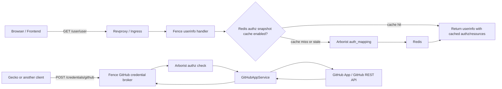
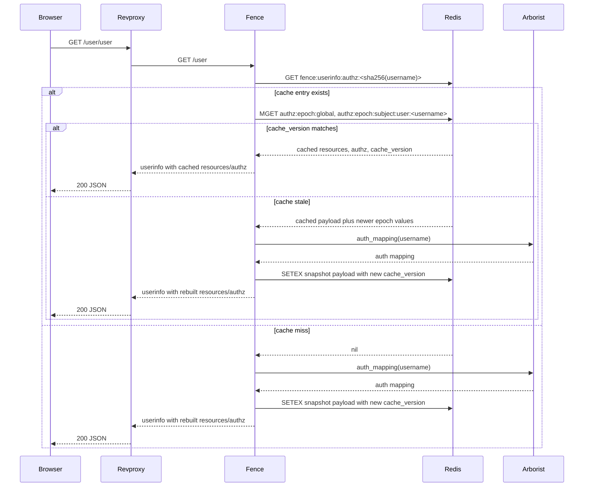
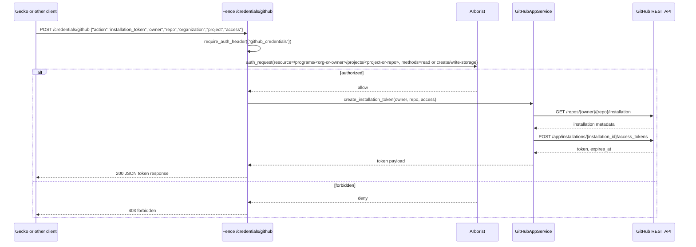

# `feature/gh-apps` branch changes

This branch adds two main capabilities to Fence:

- a Redis-backed authorization snapshot cache for the `/user/user` flow
- a GitHub App broker endpoint that can inspect installations and mint
  installation tokens for authorized users

This document is branch-specific. It describes the moving parts added on the
`feature/gh-apps` line rather than Fence behavior in general.

## High-level flow

## 1. Redis-backed `/user/user` authz snapshot cache

Implementation:

- [fence/resources/user/__init__.py](/Users/peterkor/Desktop/BMEG/fence/fence/resources/user/__init__.py)
- [fence/resources/user/authz_snapshot_cache.py](/Users/peterkor/Desktop/BMEG/fence/fence/resources/user/authz_snapshot_cache.py)

In a standard Gen3 deployment, browsers call `GET /user/user` through revproxy.
Revproxy strips the `/user` prefix and forwards the request to Fence's userinfo
endpoint. This branch changes only the Arborist-derived portion of that flow.

### What is cached

Fence still builds the full userinfo response on every request, but these two
fields can now come from Redis instead of calling Arborist each time:

- `resources`
- `authz`

The rest of the payload is still built normally from Fence state:

- `username`, `email`, `sub`, `idp`
- `project_access`
- `groups`
- Google-linked account fields
- other user/session-derived fields

### `/user/user` sequence

### Cache key layout

The cache uses three Redis key families:

- snapshot payload:
  - `fence:userinfo:authz:<sha256(username)>`
- global epoch:
  - `authz:epoch:global`
- per-user epoch:
  - `authz:epoch:subject:user:<username>`

The main payload key uses a SHA-256 of the normalized username so raw usernames
do not appear directly in the primary cache key.

### Freshness model

The cache has two freshness mechanisms:

1. TTL expiration
2. a `cache_version` hash derived from the Redis epoch keys

Important caveat:

This branch adds the reader/version-checking path, but it does not add a writer
that increments the epoch keys. In practice that means freshness is still mostly
TTL-based unless another process updates:

- `authz:epoch:global`
- `authz:epoch:subject:user:<username>`

### Configuration

Config lives in
[fence/config-default.yaml](/Users/peterkor/Desktop/BMEG/fence/fence/config-default.yaml).

Relevant settings:

- `AUTHZ_SNAPSHOT_CACHE_ENABLED`
  - default: `true`
- `AUTHZ_SNAPSHOT_CACHE_REDIS_URL`
  - default: `''`
- `REDIS_URL`
  - fallback if `AUTHZ_SNAPSHOT_CACHE_REDIS_URL` is unset
- `AUTHZ_SNAPSHOT_CACHE_TTL_SECONDS`
  - default: `3600`
  - minimum enforced value: `60`

The cache is only active when:

- `AUTHZ_SNAPSHOT_CACHE_ENABLED` is truthy
- a Redis URL is configured

The branch adds `redis` as a runtime dependency in
[pyproject.toml](/Users/peterkor/Desktop/BMEG/fence/pyproject.toml).

### Failure behavior

This cache is best-effort:

- if Redis is unavailable, Fence logs a warning and falls back to Arborist
- if Arborist fails, Fence logs the error and returns empty `resources` and
  `authz` for that response

This feature does not change Fence login/session cookie behavior directly. It is
only an optimization for the userinfo authz snapshot.

## 2. GitHub App credential broker

Implementation:

- [fence/blueprints/storage_creds/github.py](/Users/peterkor/Desktop/BMEG/fence/fence/blueprints/storage_creds/github.py)
- [fence/resources/github_app/service.py](/Users/peterkor/Desktop/BMEG/fence/fence/resources/github_app/service.py)
- [fence/blueprints/storage_creds/__init__.py](/Users/peterkor/Desktop/BMEG/fence/fence/blueprints/storage_creds/__init__.py)

This branch adds a new credentials endpoint:

- `POST /credentials/github`

The endpoint is backed by `GitHubCredentialBroker` and is protected by:

- `@require_auth_header({"github_credentials"})`

### Supported actions

The request body must include `action`. Supported values are:

- `install_url`
- `repository_installation`
- `organization_installation`
- `installation_token`
- `installation_repositories`

At a high level:

- `install_url`
  - returns a GitHub App installation URL with a `state` parameter carrying the
    desired redirect target
- `repository_installation`
  - checks whether the app is installed for a repository
- `organization_installation`
  - checks whether the app is installed for an organization
- `installation_token`
  - mints a short-lived GitHub installation token for a repository
- `installation_repositories`
  - lists repositories visible to an installation

Recent branch detail:

- the org-oriented actions accept both a GitHub `owner` and an optional Calypr
  `organization` slug
- when `organization` is omitted, Fence falls back to `owner` for Arborist
  authorization
- `installation_repositories` is keyed by `installation_id`, which is meant to
  come from an earlier installation-status or callback-derived flow

### GitHub broker sequence

For the org install-link flow, the request shape is slightly different:

- `install_url`
  - `owner` is the GitHub org login
  - `organization` is the optional Calypr org slug used for Arborist auth
  - `redirect_path` is encoded into the GitHub App `state`
- `organization_installation`
  - uses the same `owner` plus optional `organization` split
- `installation_repositories`
  - takes `installation_id` and returns repository metadata for that install

### Arborist authorization model

The broker does not blindly mint GitHub tokens. It maps requests back to
Arborist resources first.

Repository-scoped authorization:

- resource:
  - `/programs/{organization-or-owner}/projects/{project-or-repo}`
- methods for read token:
  - `read`
- methods for write token:
  - `create`
  - `write-storage`

Organization-scoped authorization:

- resource:
  - `/programs/{owner}/projects`
- method:
  - `create-descendant`

This is what lets the branch support an org-level GitHub App installation flow
without giving every logged-in user blanket GitHub access.

### GitHub API behavior

`GitHubAppService` uses a GitHub App JWT and talks to the GitHub REST API with
the Python `requests` client.

Default GitHub App permissions requested for installation tokens:

- read token:
  - `contents: read`
  - `metadata: read`
- write token:
  - `contents: write`
  - `metadata: read`
  - `pull_requests: write`

The service can:

- inspect repo installation state with `GET /repos/{owner}/{repo}/installation`
- inspect org installation state with `GET /orgs/{owner}/installation`
- mint installation tokens with
  `POST /app/installations/{installation_id}/access_tokens`
- enumerate installation repositories with
  `GET /installation/repositories`

Installation status responses can also include:

- `repository_selection`
  - whether the GitHub App install covers all repositories or only a selected
    subset

### Configuration

Config lives in
[fence/config-default.yaml](/Users/peterkor/Desktop/BMEG/fence/fence/config-default.yaml).

Relevant settings:

- `GITHUB_APP.app_id`
- `GITHUB_APP.private_key`
- `GITHUB_APP.private_key_file`
- `GITHUB_APP.install_url`
- `GITHUB_APP.api_base_url`
  - default: `https://api.github.com`
- `GITHUB_APP.timeout_seconds`
  - default: `10`

Important detail:

- `GitHubAppService` expects `GITHUB_APP.install_url`
- the OpenAPI spec and test config reflect that field
- `fence/config-default.yaml` still does not list it in the default `GITHUB_APP`
  block

So if this branch is deployed for the install-link flow, `install_url` must be
added in deployment config even though the default config block has not caught
up yet.

## 3. Scope changes in this branch

This branch adds `github_credentials` to:

- `CLIENT_ALLOWED_SCOPES`
- `USER_ALLOWED_SCOPES`

It does not add `github_credentials` to:

- `SESSION_ALLOWED_SCOPES`

That distinction matters:

- clients are allowed to request GitHub broker access
- users can receive that scope when it is explicitly requested and allowed
- normal browser session flows do not automatically gain `github_credentials`
  just because the branch adds it to the broader allow-lists

## 4. Operational notes

- The Redis cache and the GitHub App broker are independent features in this
  branch.
- The Redis cache is a latency/load optimization for `/user/user`.
- The GitHub App broker is a new control plane path for GitHub installation
  status and installation-token minting.
- If you want near-immediate authz invalidation in Redis, you still need a
  process that updates the epoch keys.
- If you want the install-link flow, make sure the deployment also sets a real
  `GITHUB_APP.install_url`.
